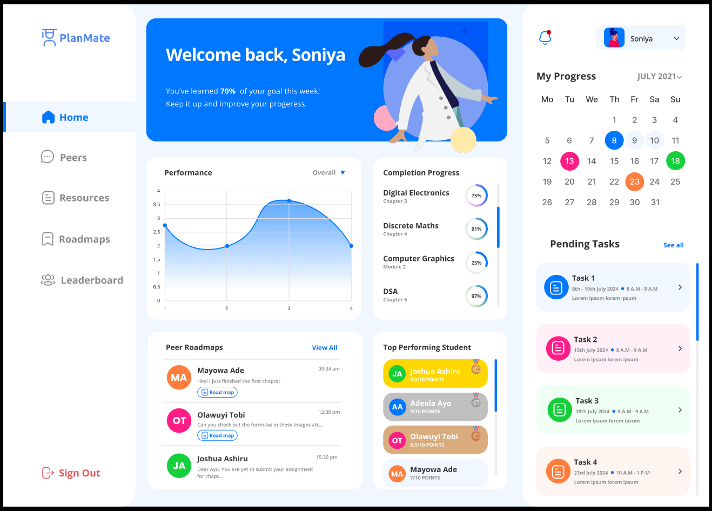

# PlanMate - Study Roadmap Creator

## Overview

**PlanMate** is a MERN stack-based web application designed to help students create and manage customized study roadmaps. It enables users to break down their study tasks into smaller, manageable chunks while providing a visual, step-wise flowchart for easy tracking and organization.

## Problem Statement

**Category**: Junior  
**Team Name**: Access Denied  
**Team Members**:  
- **Niraj Salunke** (Team Leader)  
- **Harsh Gaggar**  
- **Kaustubh Gharat**  

**Figma Design**: [PlanMate Figma Design](https://www.figma.com/design/hUfqz0440DETRiXYhqq9VR/Untitled?t=h4nE84GhnKqko28M-1)

## Features

- **Visual Roadmaps**: Create and visualize study plans using customizable flowcharts.
- **Task Management**: Break down complex subjects into smaller tasks for easier organization.
- **Progress Tracking**: Keep track of task completion and deadlines.
- **Resource Management**: Attach study materials directly to tasks for streamlined resource management.
- **Collaboration**: Share and copy study plans to promote peer learning.
- **Goal-Oriented Design**: Focus on setting and achieving learning goals.
- **Gamification**: Earn badges and track progress to stay motivated.
- **AI Recommendations (Future Integration)**: Personalized study material suggestions to enhance learning.

## Tech Stack

### Frontend:
- **TypeScript**
- **Vite + React** (with **Tauri** for desktop app creation)
- **TailwindCSS**
- **GSAP & Three.js** (for animations)
- **React-Flow** (for flowchart generation)

### Backend:
- **Node.js**
- **Express.js**

### Database:
- **MongoDB**

## Solution Architecture

PlanMate’s frontend communicates with the backend through **RESTful APIs** built using **Express.js**, ensuring seamless data flow between the user interface and server. For scalability, it’s built on the MERN stack, which can handle increased loads and allows easy adjustments to the database.

### Key Technologies:
- **React + Tauri**: Frontend technologies that enable desktop app creation.
- **React-Flow**: For smooth implementation of visual flowcharts.

### Key Algorithms:
- **Task Management**: Breaks down subjects into smaller tasks using CRUD operations.
- **Progress Tracking**: Tracks task completion percentages.
- **Resource Linking**: Allows attaching URLs and study resources to specific tasks.

## Feasibility & Challenges

PlanMate leverages open-source technologies, minimizing development costs and risks. However, potential challenges include:

- **User Adoption**: Students may find it difficult to switch to a new tool.
- **Data Security**: Handling personal study plans requires strict data protection measures.

### Strategies:
- **Unique Visual Roadmaps**: A distinctive feature that sets PlanMate apart from other study planners.
- **Data Security**: Strong encryption and secure authentication methods to protect user data.

## Prerequisites

Before getting started, ensure you have the following installed:

- **Node.js** (Recommended: version 16 or higher)
- **pnpm** (for package management)
  You can install `pnpm` globally using npm:

  ```bash
  npm install -g pnpm
  ```

- **Rust** (needed for Tauri)
  Install Rust by following the official guide:

  ```bash
  curl --proto '=https' --tlsv1.2 -sSf https://sh.rustup.rs | sh
  ```

  After installing Rust, ensure the following commands are available:

  ```bash
  cargo --version
  rustc --version
  ```

- **Tauri CLI**
  Install the Tauri Command Line Interface globally:
  ```bash
  cargo install tauri-cli
  ```

## Project Setup

1. **Clone the Repository**

   ```bash
   git clone https://github.com/NirajSalunke/PlanMate.git ./
   ```

2. **Install Dependencies**
   Install all the required packages using `pnpm`:

   ```bash
   pnpm install
   ```

3. **Running the Development Server**
   To start the Tauri development server, use the following command:

   ```bash
   pnpm tauri dev
   ```

   This will compile the Tauri app and open it in a development window.

## Building the Project

If you'd like to build the project for production, use:

```bash
pnpm tauri build
```

This will generate a packaged desktop app in the `src-tauri/target/release/` directory.

## Additional Resources

- [Tauri Documentation](https://tauri.app/v1/guides/)
- [Vite Documentation](https://vitejs.dev/guide/)
- [React Documentation](https://reactjs.org/docs/getting-started.html)
